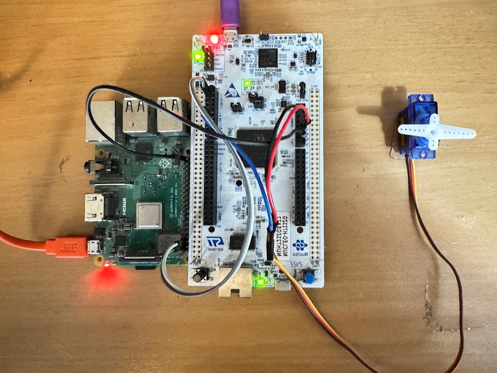

# Simple Integrated System

This research project showcases the development of an integrated system involving an embedded linux computer (Raspberry Pi) and a 32-bit microcontroller (STM32H723ZGT) with ARM processor utilizing I2C communication protocol. A Linux driver was developed which acts as an interface for the microcontroller to which peripheral devices are connected. Additionally, a custom protocol on top of I2C was designed and implemented to transfer complex data as structs.

## Project Setup

## Demo 1
The article pertinent to Demo 1 can be found in [this Medium article](https://medium.com/@rocheinside/get-your-linux-computer-to-communicate-with-a-microcontroller-finale-putting-everything-to-19e558916b18)

A video demonstration can be found in [youtube](https://youtu.be/1-XOoO1cjXc?si=miGZPy8AHBMqkSbN)

## Demo 2
An article pertinent to Demo 2 can be found in [this Medium article](https://medium.com/@rocheinside/sending-a-struct-using-i2c-979f05dc8a5b)

A video demonstration can be found in [youtube](https://www.youtube.com/watch?v=W_JbGLH2itU)

